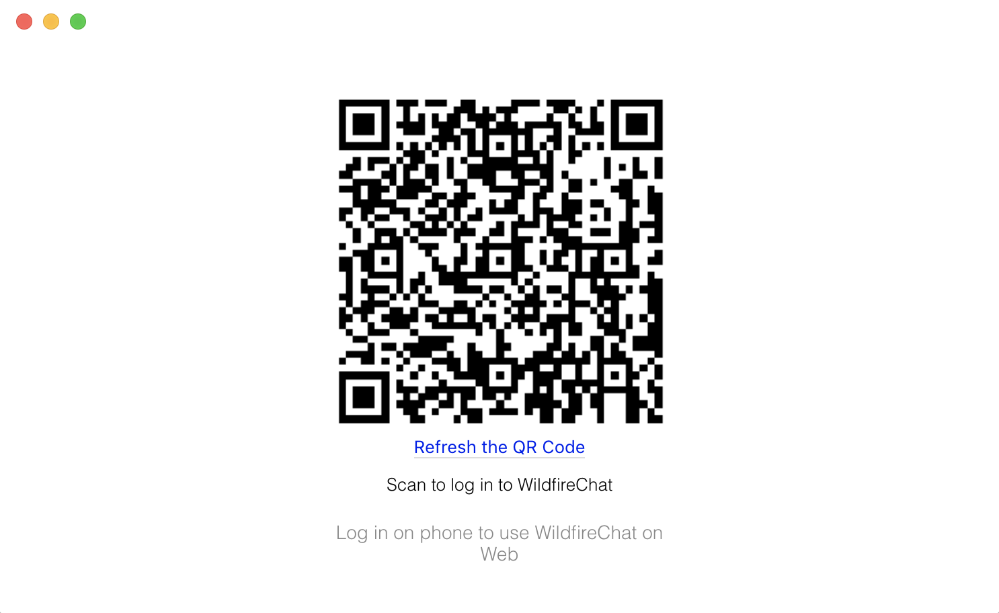
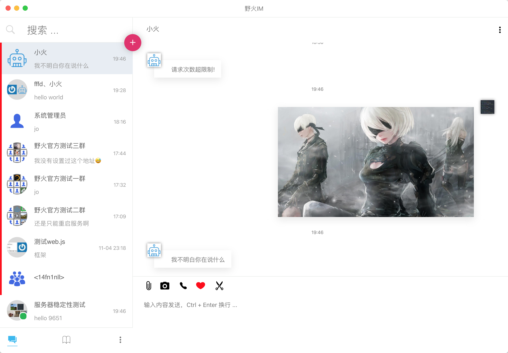
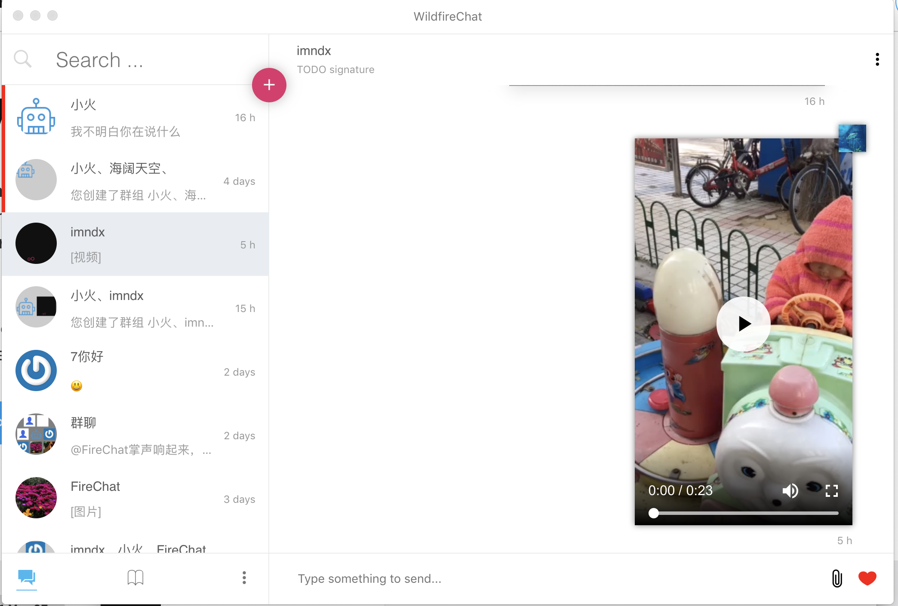
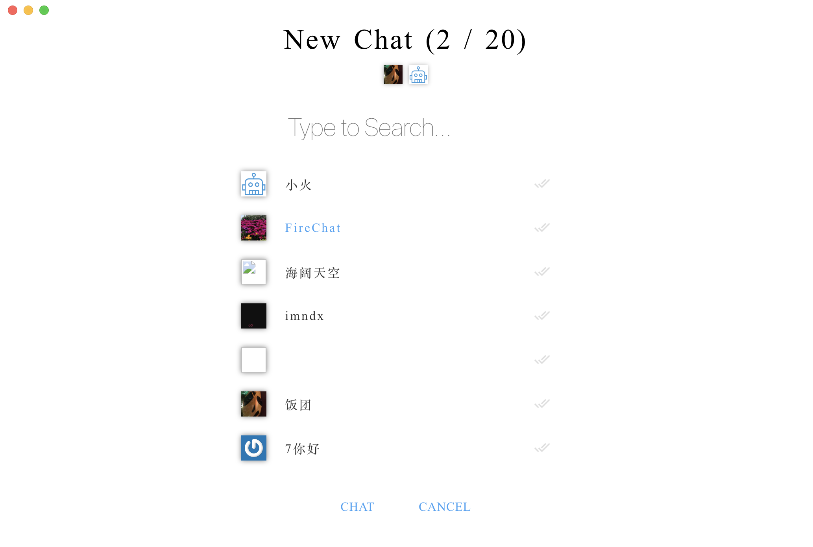

## 野火IM解决方案

野火IM是一套跨平台开源的即时通讯解决方案，主要包含以下内容。

| 仓库                                                         | 说明                                                    | 备注 |
| ------------------------------------------------------------ | ------------------------------------------------------- | ---- |
| [android-chat](https://github.com/wildfirechat/android-chat) | Android平台的SDK和Demo                                  |      |
| [ios-chat](https://github.com/wildfirechat/ios-chat)         | iOS平台的SDK和Demo                                      |      |
| [pc-chat](https://github.com/wildfirechat/pc-chat)           | 基于[Electron](https://electronjs.org/)开发的PC平台Demo |      |
| [proto](https://github.com/wildfirechat/proto)               | 野火IM的协议栈实现                                      |      |
| [server](https://github.com/wildfirechat/server)             | IM server                                               |      |
| [app server](https://github.com/wildfirechat/app_server)     | 应用服务端Demo                                          |      |
| [robot_server](https://github.com/wildfirechat/robot_server) | 机器人服务端Demo                                        |      |
| [push_server](https://github.com/wildfirechat/push_server)   | 推送服务器                                              |      |
| [docs](https://github.com/wildfirechat/docs)                 | 野火IM相关文档，包含设计、概念、开发、使用说明          |      |
> 上述仓库中只有PC有个功能库没有开源需要授权才能使用，其它代码全部开源。详细说明请参加[费用](http://docs.wildfirechat.cn/#费用)

## pc-chat说明

本工程是野火IM PC平台，详情可以阅读[docs](http://docs.wildfirechat.cn).

开发一套IM系统真的很艰辛，请路过的朋友们给点个star，支持我们坚持下去🙏🙏🙏🙏🙏

### 联系我们

> 商务合作请优先采用邮箱和我们联系。技术问题请到[野火IM论坛](http://bbs.wildfirechat.cn/)发帖交流。

1. heavyrain.lee  邮箱: heavyrain.lee@wildfirechat.cn  微信：wildfirechat
2. imndx  邮箱: imndx@wildfirechat.cn  微信：wfchat


### 问题交流

1. 微信交流群（请先加我们好友，我们再邀请您进群）

     

2. 如果大家发现bug，请在GitHub提issue
3. 其他问题，请到[野火IM论坛](http://bbs.wildfirechat.cn/)进行交流学习
4. 微信公众号


## 体验

可下载我们已编译好的可执行文件进行体验，[pc-chat 下载](https://github.com/wildfirechat/pc-chat/releases)











更多截图，请查看[wewechat readme](./README_wewechat.MD)


## 开发

#### mac系统
开发

```
$ cp proto_addon/marswrapper.mac.node marswrapper.node
$ npm install
$ npm run dev
```

打包

1. ```npm install``` 安装依赖
2. ```npm run package-win32``` 打包window版本，软件生成在release目录下
3. ```npm run package-mac``` 打包mac版本，软件生成在release目录下


#### windows系统

##### 环境准备

> 请严格安装下面的版本安装对应依赖，否则无法打包

1. nodejs10.16.0
2. python2.7
3. Visual Studio Community 2015(C++ Runtime & Windows SDK version 8.1)
4. npm install -g node-gyp


##### 开发(目前还有问题，请打包安装验证，请跳过这一段)
```
$ copy proto_addon\marswrapper.win32.node marswrapper.node
$ npm install
$ npm run dev
```

##### 打包
1. ```npm install``` 安装依赖
2. ```npm run package-win32``` 打包window版本，软件生成在release目录下

> mac下能打包出windows版本和mac版本。windows下只能打包出windows版本

##### 常见问题
windows上需要严格按照环境进行安装，mac上环境比较简单一些，安装node和node-gyp就可以了
另外如果还有问题，请试试命令```npm cache clean --force ```

更多信息，请查看[wewechat readme](./README_wewechat.MD)


## License

1. Under the MIT license. See the [LICENSE](https://github.com/wildfirechat/mars/blob/firechat/LICENSE) file for details.

2. Under the 996ICU License. See the [LICENSE](https://github.com/996icu/996.ICU/blob/master/LICENSE) file for details.


# 鸣谢

本项目基于[wewechat](https://github.com/trazyn/weweChat)开发，原项目的READ见[wewechat readme](./README_wewechat.MD)
